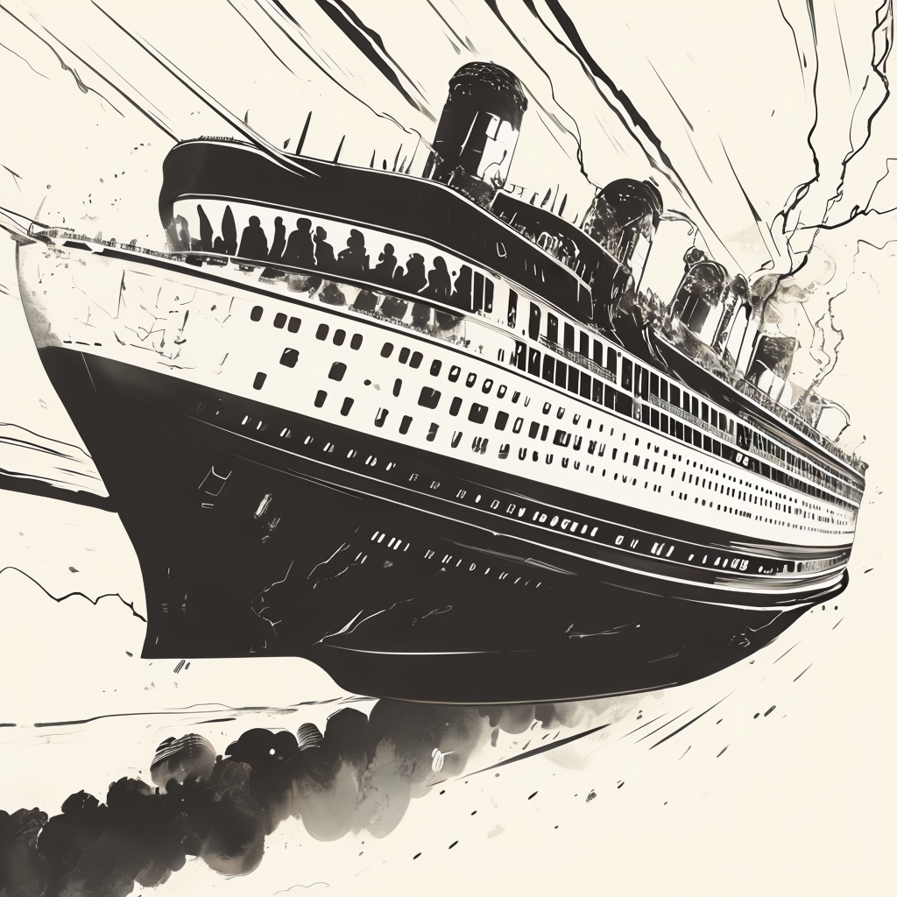
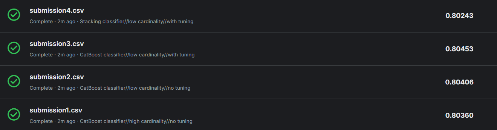
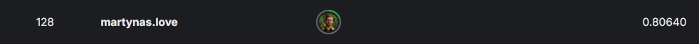

# Spaceship Titanic: Passenger Fate Prediction

## Table of Contents
- [Introduction](#introduction)
- [Project Overview](#project-overview)
- [Installation](#installation)
- [Usage](#usage)
- [Data](#data)
- [Methodology](#methodology)
- [Results](#results)
- [Contributing](#contributing)
- [License](#license)

---

## introduction

This project analyzes the digital wreckage of the Spaceship Titanic to predict which passengers were transported to an alternate dimension during a collision with a spacetime anomaly.

---

## project-overview

Our mission is to predict passenger fates using machine learning techniques. We employ data cleaning, exploratory data analysis, statistical inference, and various modeling approaches to achieve this goal.

---

## Installation

To set up the project environment:

1. Clone the repository:
`git clone https://github.com/MLovei/titanic-spaceship`

2. Navigate to the project directory:
`cd titanic-spaceship`

3. Create a virtual environment (optional but recommended):
`python -m venv venv`
`source venv/bin/activate # On Linux/macOS`
`venv\Scripts\activate # On Windows`

4. Install the required packages:
`pip install -r requirements.txt`

## usage

To run the project:

1. Open the notebook `titanic_playground.ipynb` in your preferred IDE (e.g., Jupyter Notebook or VS Code).
2. Run all cells sequentially to preprocess data, train models, and generate predictions.
3. Submit predictions to Kaggle using the provided submission commands.

___

## data

The dataset is sourced from the Kaggle competition "Spaceship Titanic." It includes passenger information such as age, home planet, cabin location, and spending habits.

---

## methodology

1. **Data Cleaning and Preprocessing**
2. **Exploratory Data Analysis**
3. **Feature Engineering**
4. **Model Selection and Training**
5. **Hyperparameter Tuning**
6. **Ensemble Methods**

---

## results

### Submission Results Overview

Here’s a snapshot of the submission results for the Spaceship Titanic competition:

### Leaderboard Victory: Top Spot Secured!

After testing twice the amount on tree-based models and combining them into a stacked classifier, we achieved this **top spot** in the leaderboard:

---

## contributing

Contributions to this project are welcome. Please fork the repository and submit a pull request with your changes.

---

## license

This project is licensed under the MIT License.
